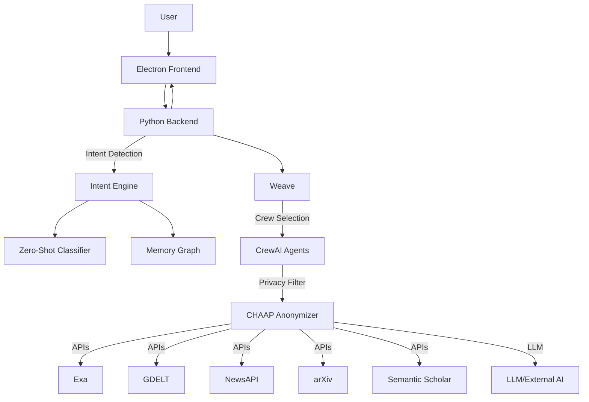

# Gyrus: The Thoughtful AI Browser

  

## Technical Summary
Gyrus is a privacy-first, AI-augmented browser that supports human thinking. It combines an Electron.js frontend with a Python backend orchestrating AI agents ("crews"), intent detection, and a memory graph. It uses fine-tuned models, privacy-preserving flows, and modular API integrations.

## Inspiration
AI is everywhere, but over-reliance can dull critical thinking. Gyrus aims to *support* thought, not replace it, by embedding helpful AI in a browser.

## What It Does
- Organizes thoughts and learning without doing all the thinking for you
- Uses "crews" (AI agent teams) to personalize your experience
- Detects intent via a memory graph and zero-shot classifier
- Guides research, study, and exploration
- Anonymizes data with CHAAP before sending to AI models

### Features
- Intent detection (zero-shot classifier, memory graph)
- Modular AI crews (CrewAI)
- Privacy layer (CHAAP)
- Smart search (Exa, GDELT, NewsAPI)
- Real-time reasoning (Langchain, Weave)
- Electron-based UI

### Architecture
- **Frontend:** Electron.js app with custom web components
- **Backend:** Python server for agent orchestration, intent detection, memory, and APIs
- **Data Flow:** User → Frontend → Backend (intent, crew, privacy) → AI/APIs → Frontend

## How We Built It
- **Frontend:** Electron.js, custom HTML/CSS/JS, REST/WebSocket to backend
- **Backend:** Python (Flask/FastAPI style), Tailscale, integrates GDELT, NewsAPI, Exa, CrewAI, Langchain, Weave, CHAAP
- **ML:** Fine-tuned Deberta using intent dataset (ORCAS-II) for intent
- **Privacy:** All data anonymized with CHAAP; no persistent sensitive storage offline

## Getting Started

### Prerequisites
- requirements.txt

### Backend
1. `cd backend`
2. `python3 -m venv venv && source venv/bin/activate`
3. `pip install -r requirements.txt`
4. Set up `backend/.env`
5. `python src/app.py`

### Frontend
1. `cd browser`
2. `npm install`
3. `npm start`

### Connect
- Frontend expects backend at `http://localhost:5000` (configurable)
- For remote use, run backend on Tailscale and update frontend config

## Architecture Diagram

## Key Tech
- **Frontend:** Electron.js, Web Components
- **Backend:** Python, Flask/FastAPI, Tailscale
- **AI/ML:** Roberta, CrewAI, Langchain, Weave
- **Privacy:** CHAAP
- **APIs:** Exa, GDELT, NewsAPI
- **Data:** ORCAS-II

## Contributing
- Fork, branch, and PR
- Backend: PEP8, add tests
- Frontend: consistent components, document UI

## Challenges
- CrewAI/Weave dependencies
- Exa query sensitivity
- Scaling classifier and data cleaning
- Remote hackathon logistics

## Proud Of
- Real-time classifier on large data
- Intent + memory graph integration
- Privacy-first AI browser in days

## Learned
- Agent orchestration (MCP, LLMs)
- Fine-tuning for real-world tasks
- Keeping AI helpful without replacing thought

